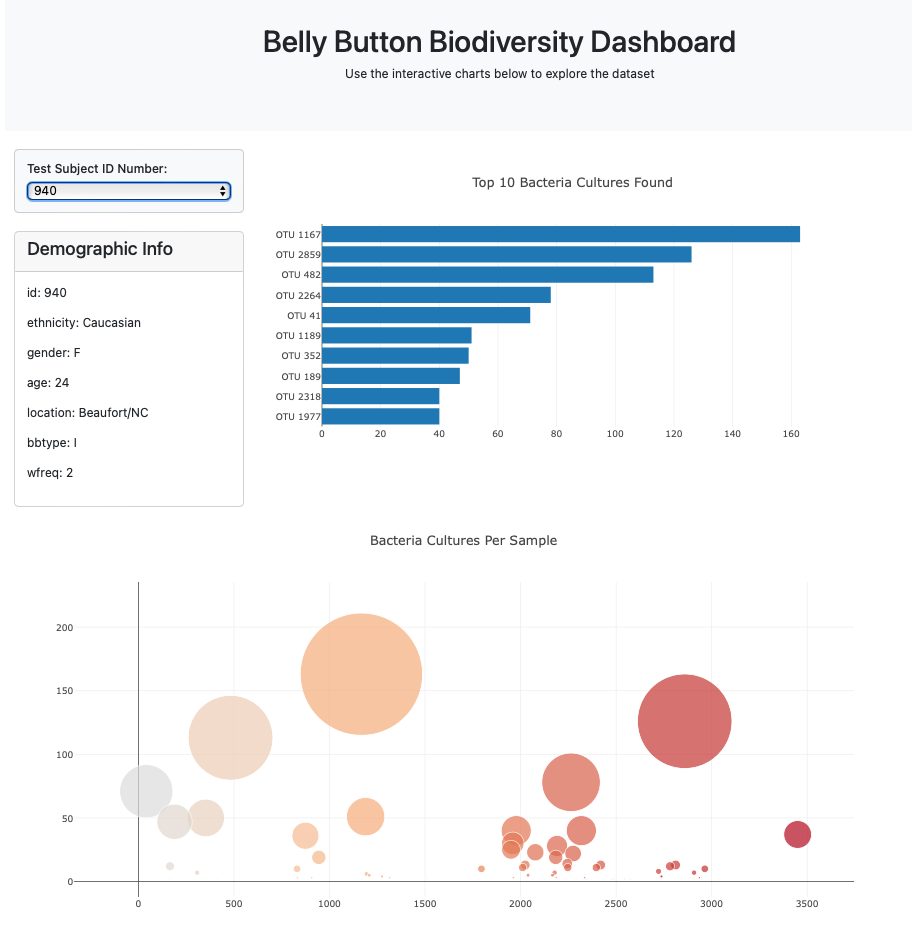

# Belly-Button-Challenge
Module 14 Challenge

## Project Overview
This project is to build a dashboard to display the microbes that colonize in human navels, or belly buttons.

## Objectives
Use the D3 library to read in a JSON format data and create the following:

1. Bar chart with a dropdown menu to display the top 10 OTUs (operational taxonomic units, or microbial species) found in that individual.
2. Create a bubble chart that displays each sample.
3. Display the sample's metadata, for example, an individual's demographic information by looping each key-value pair from the metadata JSON object. 

The result should look like the image below.

HTML view available <a href="https://mshintaku205/belly-button-challenge/blob/main/index.html">here</a>

## References
* Hulcr, J. et al. (2012) A Jungle in There: Bacteria in Belly Buttons are Highly Diverse, but Predictable. Retrieved from: http://robdunnlab.com/projects/belly-button-biodiversity/results-and-data/
* bubble chart: https://plotly.com/javascript/bubble-charts/
* colorscale for bubble chart: https://plotly.com/javascript/colorscales/